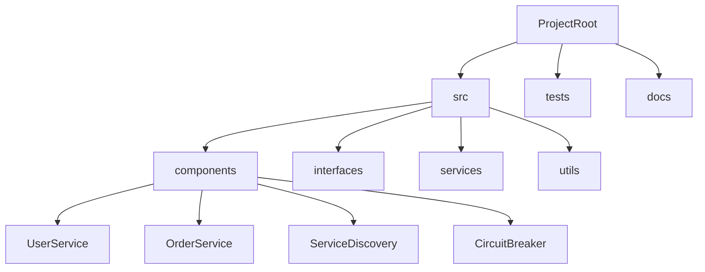
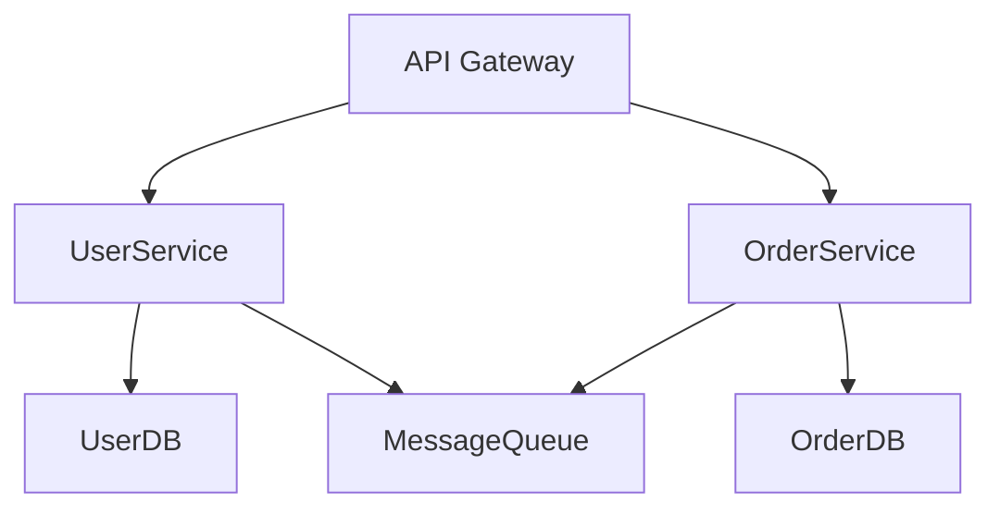
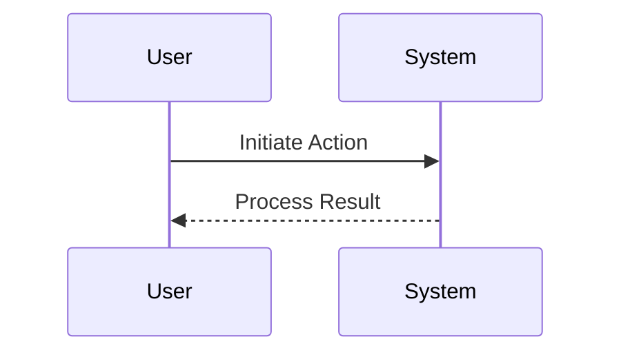

# my_awesome_microserv

## Overview
my_awesome_microserv is designed to This project demonstrates the Microservices Architecture, where the application is divided into multiple small, loosely coupled, and independently deployable services using Microservices Architecture patterns, adhering to systematic approaches for maintainability and scalability.

## Architecture
### Design Patterns
- Microservices Architecture

### Software Architecture
- Distributed System

### Components and Modules
- **UserService**: Handles user-related operations.
  - Interface: [i_userservice.py](./src/interfaces/i_userservice.py)
  - Implementation: [userservice.py](./src/components/userservice.py)
  - Service: [userservice_service.py](./src/services/userservice_service.py)
  - Tests: [test_userservice.py](./tests/test_userservice.py)
- **OrderService**: Handles order-related operations.
  - Interface: [i_orderservice.py](./src/interfaces/i_orderservice.py)
  - Implementation: [orderservice.py](./src/components/orderservice.py)
  - Service: [orderservice_service.py](./src/services/orderservice_service.py)
  - Tests: [test_orderservice.py](./tests/test_orderservice.py)
- **ServiceDiscovery**: Service discovery component for registering and discovering microservices.
  - Interface: [i_servicediscovery.py](./src/interfaces/i_servicediscovery.py)
  - Implementation: [servicediscovery.py](./src/components/servicediscovery.py)
  - Service: [servicediscovery_service.py](./src/services/servicediscovery_service.py)
  - Tests: [test_servicediscovery.py](./tests/test_servicediscovery.py)
- **CircuitBreaker**: Circuit breaker component to handle fault tolerance in microservices.
  - Interface: [i_circuitbreaker.py](./src/interfaces/i_circuitbreaker.py)
  - Implementation: [circuitbreaker.py](./src/components/circuitbreaker.py)
  - Service: [circuitbreaker_service.py](./src/services/circuitbreaker_service.py)
  - Tests: [test_circuitbreaker.py](./tests/test_circuitbreaker.py)

### Relationships
- UserService interacts with OrderService via REST API, Message Queues
- OrderService interacts with ServiceDiscovery via REST API, Message Queues
- ServiceDiscovery interacts with CircuitBreaker via REST API, Message Queues

### Interfaces
class IUserService:
    # TODO: Define UserService methods
    pass

class IOrderService:
    # TODO: Define OrderService methods
    pass

class IServiceDiscovery:
    # TODO: Define ServiceDiscovery methods
    pass

class ICircuitBreaker:
    # TODO: Define CircuitBreaker methods
    pass

### Communication Protocols
REST API, Message Queues

### Technologies
Python, Flask, Docker, Kafka

### Dependencies
requests, pytest, docker, confluent-kafka

### Commands
- **Installation**: `pip install -r requirements.txt`
- **Build**: `docker build .`
- **Run**: `docker-compose up`
- **Test**: `pytest`

## File Structure

## Implementation Strategy
### File Implementation Order
1. src/components/userservice.py
2. src/components/orderservice.py
3. src/components/servicediscovery.py
4. src/components/circuitbreaker.py
### Testing Strategies
- Unit Tests: Use pytest for component-level testing.
- Integration Tests: Verify inter-component interactions.
### Build and Deployment
- Build: `docker build .`
- Deploy: Use Docker containers or a cloud platform like AWS.

## Mermaid Diagrams
### Architecture Diagram

### File Structure

### Process Flow

## Instructions for Composer Implementor Agent
1. Refine the generated documentation in README.md.
2. Implement components starting with core logic in src/components/.
3. Use mermaid_tool for additional visualizations (e.g., `mermaid_tool 'detailed process flow'`).
4. Follow the implementation strategy and test using provided commands.
